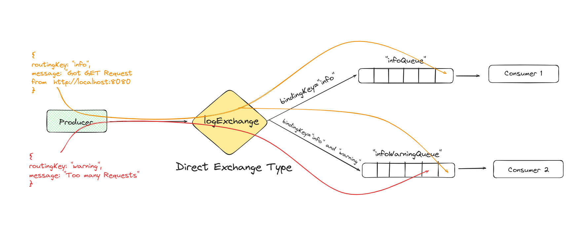

## RabbitMQ

It is used as **MessageBroker** between two services for communication.

## Steps

Steps followed in this folder

1. get the docker image of rabbitmq server `docker pull rabbitmq:management` `docker run -it --name rabbitmq -p 15672:15672 -p 5672:5672 rabbitmq:management`

2. `http://localhost:15672` guest guest for the visualization

NOTE: Do not create multiple channel, only one channel for all message

3. connect to the rabbitmq server with npm package for rabbitmq node `npm install ampqlib`

4. write the code for producer and consumer create a producer class for the producer and then consumer server to consume that message from the producer

Here in this project `Direct` is used so that consumer which match the producer `key` will consume the message.

Here I have one `**Producer**` server and two `**Consumer**` server.

- [Producer Server](./producer/producer.ts)

- **Consumer 1** will only get the message with key: `info`
  [Consumer 1](./consumer/app.ts)

- **Consumer 2** will get the message with key : both `info` and `warning`.
  [Consumer 2](./consumer%202/app.ts)
