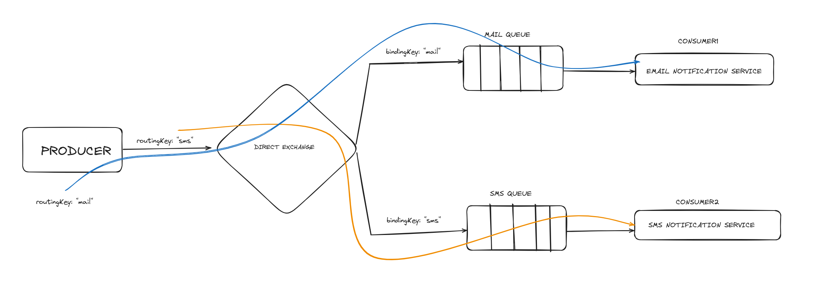

## Direct Exchange

The direct exchange will route the message to a queue whose binding key matches the routing key of the messages exactly. So for example in our `Example of SMS and Email Notification`, if we bind a queue to a **direct exchange** with the binding key `email` all messages published to that exchange with the rouging key `email` will end up in that queue. One Queue can have multiple bindings to the same exchange with different binding keys.

#### Producer

Producer publish messages with the `message` and `routingKey`.

[Producer](./producer.ts)

#### Consumers

Different Consumer services consume published message by matching their **binding key**.

[Email Service](./consumer1.ts)

[SMS Service](./consumer2.ts)
