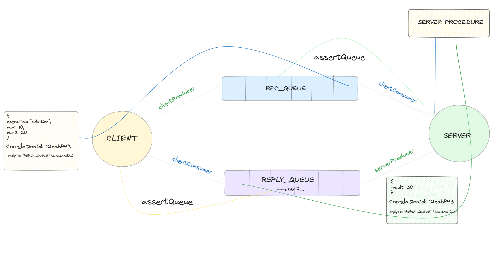

## Remote Procedure Call in RabbitMQ

A **Remote Procudure Call** is a software communication protocol that one program uses to request a service from another program located on a different computer and network withoutt having to understand the networks details. Specifically `**RPC**` is used to call another processes on remote systems as if the process were a local system. A procedure call is sometimes known as a function call or a subroutine call.

## Steps Followed

Here is the description of all the steps followed

**[App Client](./appClient.ts)** is a simple express server which is like where the user will send the request to the remote **RPC** server through the API provided by this **client** in which the **[Rabbit MQ Client Producer](./rabbitmq/rpc%20Client/clientProducer.ts)** will produce the message in the `**RPC_QUEUE**`.

RabbitMQ Client Produce then produce message after initializing the rabbitmq channels with its unique `correlationId`, a queue `reply_queue` which it uses to consume and `data` to the `rpc_queue`.

**[Rabbit MQ Client Folder](./rabbitmq/rpc%20Client/)** contains all the client setup i.e client consumer and client producer.

**[Rabbit MQ Server Folder](./rabbitmq/rpc%20Server/)**contains all the code for the remote server which handle all the procure and produce the response. First of all **[App Server](./appServer.ts)** will initialize the rabbitmq server which creates a channel and bind a `rpc_queue` to which it consumes a request message.

When the server consumer the message through the `rpc_queue` it calls the **[Procudure Handler](./rabbitmq/rpc%20Server/procudure.ts)** with the message from the client producer and the **Procedure Handler** will perform the required operation then publish the message through **[Server Producer](./rabbitmq/rpc%20Server/serverProducer.ts)** in the `reply_queue` and with `response` and `correlation ID` that the client had sent when had requested.

In this way Remote Procudure Call is Performed with the help of RabbitMQ in node js.

> When in doubt it is suggested to avoid RPC and if we can should use an `asynchronous pipeline` because results are asynchronoulsy pushed to a next computation stage.
