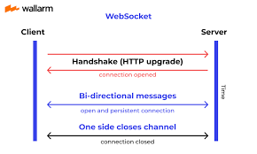

# Backend communication

various ways backend talk to each other

- `PubSub`: BE1 - PubSub - [BE1, BE2, BE4]
- `Web Socket`: BE1 - websocket - [BE4] or Client - Server
- `Request Response`: BE1 - HTTP - [BE2]
- `Message Queue`: BE1 - Message queue - [BE3]

# Types of Communication

- Synchronous (strong coupling)
  - HTTP
  - Websocket
- Asynchronous
  - Message queues system
  - Pub Sub
  - Server Sent Events
  - Websocket

# WebSocket

A communication protocol providing a simultaneous two way full duplex communication channel over a single TCP connection. It enables real time bidirectional communication between a client (browser) and server.

    

# setup
- setup ts and express
`npm install ws` for websocket
`npm install @types/ws` type

# start the server
- tsc -b
- node dist/index.js

# connect from different client
- from mobile
- from postman
- from webbrowser